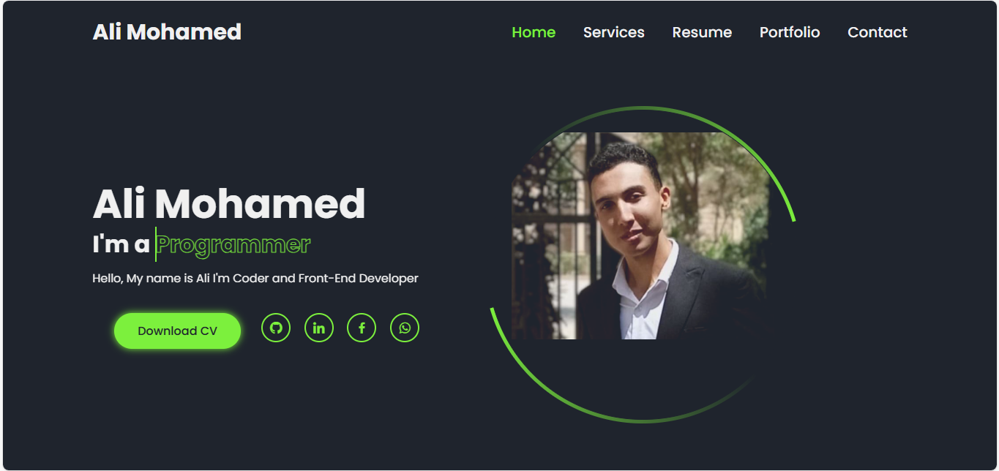

# Portfolio Website

A personal portfolio website showcasing front-end development skills, projects, and experience.

## Features

- Responsive design
- Interactive elements
- Project showcase
- Contact information
- Clean and modern UI

## Technologies Used

- HTML5
- CSS3
- JavaScript

## Getting Started

1. Clone or download the project files.
2. Open `porfolio.html` in a web browser to view the site.

## File Structure

- `porfolio.html` - Main HTML file
- `style.css` - Stylesheet
- `script.js` - JavaScript functionality
- `images/` - Directory for images
- `Ali Mohamed - Front-End Developer.pdf` - Resume or CV

## Customization

- Edit `porfolio.html` to update content
- Modify `style.css` for styling changes
- Update `script.js` for interactive features

## License

This project is for personal use.
